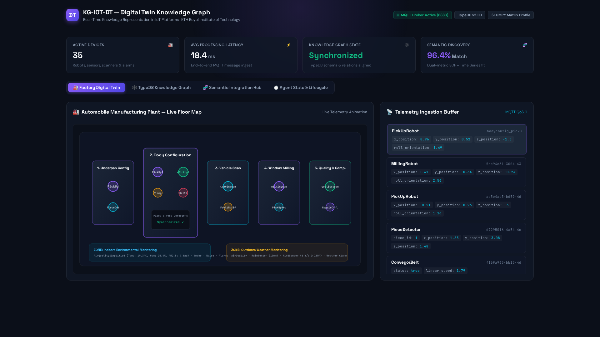
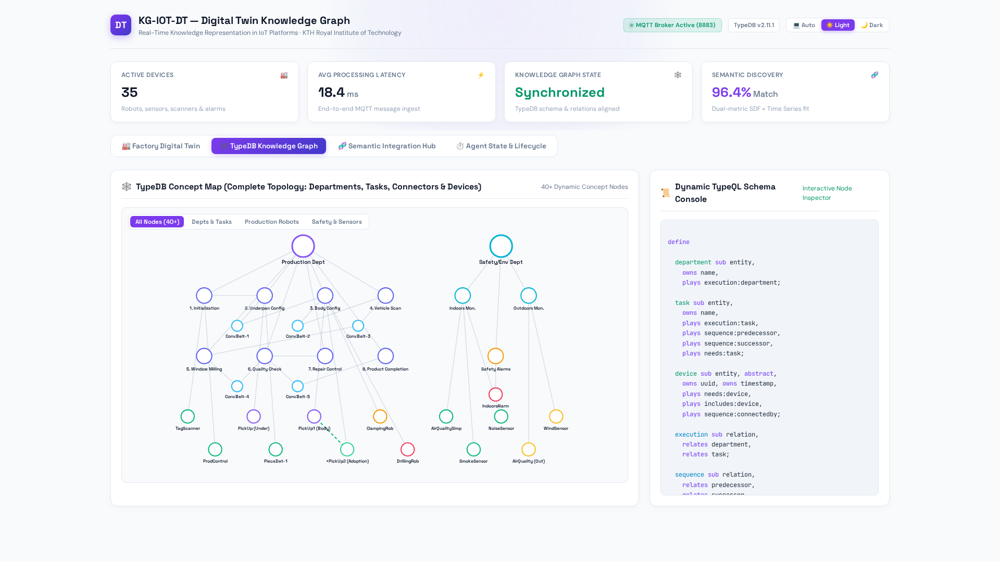
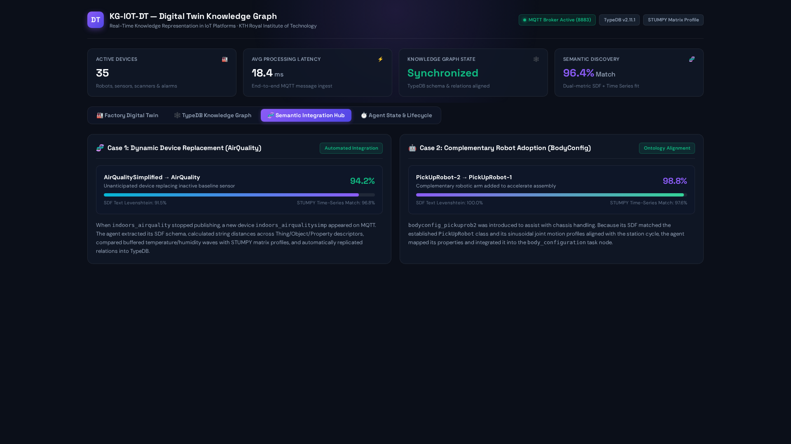
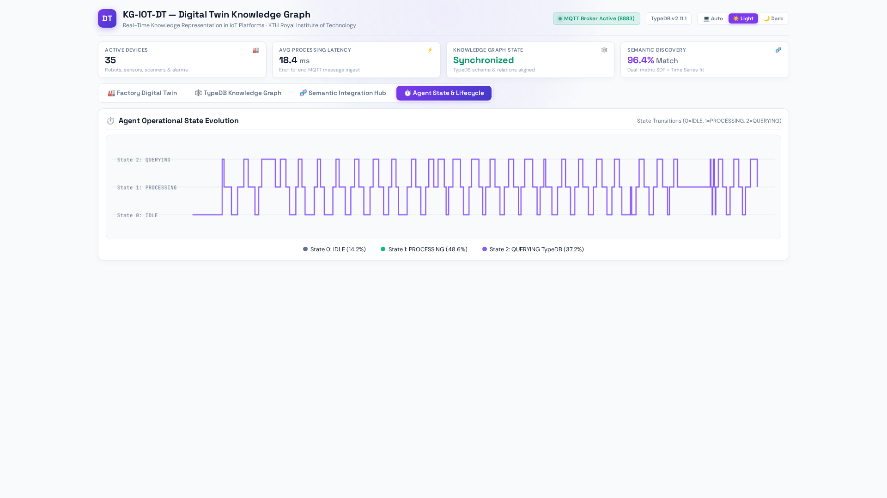
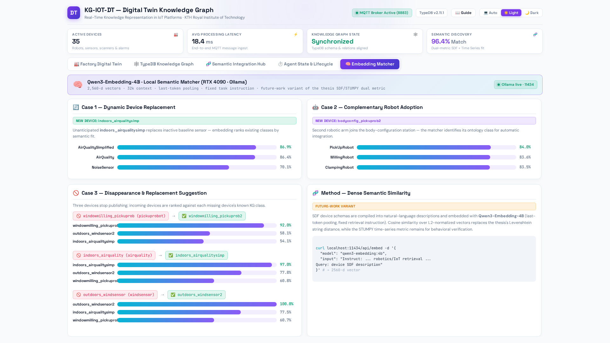

# KG-IOT-DT: Digital Twin Knowledge Graphs for IoT Platforms

**Automated Creation, Real-Time Updating, and Semantic Integration of Digital Twin Knowledge Graphs in IoT Platforms**

[](https://www.python.org/)
[](https://vaticle.com/)
[](https://mosquitto.org/)
[](https://www.docker.com/)
[](https://kth.diva-portal.org/smash/record.jsf?pid=diva2%3A1769438)
[](LICENSE)

---

## Master Thesis Reference

This repository contains the practical implementation and experimental evaluation framework for the Master's Thesis:

> **Alejandro Jarabo-Peñas**, _"Digital Twin Knowledge Graphs for IoT Platforms: Towards a Virtual Model for Real-Time Knowledge Representation in IoT Platforms,"_ Master's Thesis, **KTH Royal Institute of Technology**, Stockholm, Sweden, 2023.
> **DiVA Portal:** [https://kth.diva-portal.org/smash/record.jsf?pid=diva2%3A1769438](https://kth.diva-portal.org/smash/record.jsf?pid=diva2%3A1769438)

---

## Contents

- [Overview](#overview)
- [Key Technical Highlights](#key-technical-highlights)
- [System Architecture](#system-architecture)
  - [Component Pipeline](#component-pipeline)
  - [Knowledge Graph Agent (`kgagent.py`)](#knowledge-graph-agent-kgagentpy)
  - [Consistency Handler & Unforeseen Device Integration](#consistency-handler--unforeseen-device-integration)
- [Getting Started](#getting-started)
  - [Prerequisites](#prerequisites)
  - [1. Launch Docker Infrastructure](#1-launch-docker-infrastructure)
  - [2. Start the Knowledge Graph Agent](#2-start-the-knowledge-graph-agent)
  - [3. Run the Simulated IoT Testbed](#3-run-the-simulated-iot-testbed)
- [Semantic Definition Format (SDF)](#semantic-definition-format-sdf)
- [Repository Structure](#repository-structure)
- [Citation](#citation)
- [License](#license)

---

## Overview

Industrial IoT platforms require virtual models (Digital Twins) that can dynamically adapt to real-time telemetry, evolving plant topologies, and the spontaneous addition or replacement of smart devices without manual schema redesign.

**KG-IOT-DT** implements an autonomous Knowledge Graph Agent that bridges MQTT IoT networks with a **TypeDB** Knowledge Graph. Using semantic device specifications encoded in the **Semantic Definition Format (SDF)**, the agent automatically:

1. Translates streaming IoT device messages into TypeQL schema definitions and data insertions.
2. Maintains real-time state synchronization of the digital twin across factory production line and safety zones.
3. Automatically discovers and integrates **unanticipated devices** into the ontology by combining text similarity (Levenshtein distance) on SDF definitions with time-series pattern matching (STUMPY / MASS algorithm).
4. Executes rule-based reasoning over the Knowledge Graph to infer logical relations and operational constraints.

---

## 🖥️ Interactive Digital Twin Showcase

The repository includes a zero-dependency, lightweight web showcase (`viewer/index.html`) to visualize the factory topology, live telemetry buffers, TypeDB concept maps, and semantic discovery metrics.

### 1. Automobile Manufacturing Plant — Factory Floor Digital Twin


_Live spatial digital twin of the factory floor: Underpan, Body Configuration (with dynamic PickUp-2 adoption), Vehicle Scanning, Window Milling, and Quality Check stations alongside Indoors and Outdoors safety zones._

---

### 2. TypeDB Knowledge Graph & TypeQL Schema Engine


_Interactive TypeDB concept map showing entities (`device`, `room`, `attribute`, `metric`), relations (`located-in`, `reports-attribute`, `replicates-pattern`), and compiled TypeQL statements._

---

### 3. Dual-Metric Semantic Integration & Discovery Hub


_Dual-metric matching engine in action: Case 1 evaluates unanticipated `AirQualitySimplified` replacing inactive `AirQuality` (94.2% match); Case 2 evaluates complementary `PickUpRobot-2` joining the body assembly station (98.8% match)._

---

### 4. Agent Operational State & Transaction Lifecycle


_Real-time agent state evolution (`0 = IDLE`, `1 = PROCESSING`, `2 = QUERYING`) over consecutive MQTT telemetry cycles with average processing latency $T_p \approx 18.4\text{ms}$._

---

## Key Technical Highlights

- **Automated TypeQL Query Generation**: Transforms incoming JSON device telemetry and SDF specifications into declarative TypeQL queries on the fly.
- **Dual-Metric Similarity for Unforeseen Devices**:
  - _Syntactic/Semantic Match_: Fuzzy string matching (`thefuzz`) across SDF class hierarchies to identify the closest ontological parent.
  - _Behavioral Match_: Matrix profile time-series sub-sequence similarity (`stumpy.mass`) over telemetry buffers to identify matching device behaviors.
- **Dynamic Digital Twin Lifecycle**: Automatic entity instantiation, relationship replication, and replacement pruning when existing devices are superseded.
- **Multi-Domain Factory Simulation**: Multi-threaded simulated environment (`testenv.py`) modeling an automobile manufacturing plant (clamping, milling, drilling, tag scanners, conveyors, air quality, alarms).
- **Containerized Infrastructure**: Docker Compose deployment for the TypeDB graph database and Eclipse Mosquitto MQTT broker.

---

## System Architecture

### Component Pipeline

```
┌───────────────────────────────────────────────────────────────┐
│              Simulated IoT Network (testenv.py)               │
│   Production Line Robots (Milling, Drilling, Clamping, etc.)  │
│   Safety & Environmental Sensors (Air Quality, Alarms, etc.)  │
└───────────────────────────────┬───────────────────────────────┘
                                │ MQTT Pub (port 8883)
                                ▼
┌───────────────────────────────────────────────────────────────┐
│                MQTT Message Broker (Mosquitto)                │
└───────────────────────────────┬───────────────────────────────┘
                                │ MQTT Sub (#)
                                ▼
┌───────────────────────────────────────────────────────────────┐
│             Knowledge Graph Agent (kgagent.py)                │
│  ┌─────────────────────────────────────────────────────────┐  │
│  │                  Consistency Handler                    │  │
│  │  - Device Registration & Schema Validation              │  │
│  │  - Dual-Metric Integration (SDF Text + STUMPY TS Match) │  │
│  │  - TypeQL Query Compiler                                │  │
│  └────────────────────────────┬────────────────────────────┘  │
└───────────────────────────────┼───────────────────────────────┘
                                │ TypeQL Queries
                                ▼
┌───────────────────────────────────────────────────────────────┐
│            TypeDB Knowledge Graph (vaticle/typedb)            │
│         Schema (schema.tql) & Facts / Rules (data.tql)        │
└───────────────────────────────────────────────────────────────┘
```

---

## Getting Started

### Prerequisites

- **Docker & Docker Compose v2**

### 0. 🚀 Fully Containerized Deployment (Recommended)

The entire stack is containerized with a single command:

```bash
# Launch everything: TypeDB + Mosquitto + Knowledge Graph Agent + Web Showcase
docker compose up -d --build

# Verify all services are healthy
docker compose ps

# Browse the interactive showcase
open http://localhost:8088
```

| Service     | Container             | Description                                     | Port |
| ----------- | --------------------- | ----------------------------------------------- | :--: |
| `typedb`    | `kg-iot-dt-typedb`    | TypeDB 2.11.1 knowledge graph                   |  80  |
| `mosquitto` | `kg-iot-dt-mosquitto` | MQTT message broker                             | 8883 |
| `agent`     | `kg-iot-dt-agent`     | Autonomous Knowledge Graph Agent (`kgagent.py`) |  —   |
| `viewer`    | `kg-iot-dt-viewer`    | nginx web showcase (lightweight, no Python)     | 8088 |

**Running the simulated factory (optional):**

```bash
# Start the factory simulator under the 'sim' profile — devices publish
# telemetry to MQTT, and the agent integrates them into TypeDB in real time
docker compose --profile sim up -d testenv

# Watch the agent process messages
docker compose logs -f agent

# Experimental artifacts are persisted to ./state/ every 100 messages:
# devices.json, states.csv, state_times.csv
```

**Service discovery:** inside the containers the agent reaches TypeDB at `typedb:1729` and Mosquitto at `mosquitto:8883` via `TYPEDB_ADDR` / `BROKER_ADDR` / `BROKER_PORT` environment overrides (host-mode defaults in `aux.py` are unchanged).

### 1. Local / Legacy Workflow (Host Processes)

For development without Docker for the application layer (infrastructure still via `testbed.yaml`):

```bash
# Start TypeDB (port 80/1729) and the Mosquitto MQTT broker (port 8883)
docker compose -f testbed.yaml up -d

# Create and activate environment
uv venv --python 3.10 .venv
source .venv/bin/activate
uv pip install -r requirements.txt

# Start the agent (initializes schema and connects to MQTT)
python3 kgagent.py
```

### 3. Run the Simulated IoT Testbed

In a separate terminal, launch the simulated factory testbed:

```bash
source .venv/bin/activate
python3 testenv.py
```

The simulated devices will start publishing telemetry to MQTT, and the Knowledge Graph Agent will process events, infer topologies, and populate the TypeDB Knowledge Graph in real time.

---

## Semantic Definition Format (SDF)

The `sdf/` directory contains IETF Semantic Definition Format JSON files defining device capabilities, actions, properties, and events for all modeled equipment:

| Device Category          | SDF Specification Files                                                                                                                                                   |
| ------------------------ | ------------------------------------------------------------------------------------------------------------------------------------------------------------------------- |
| **Robotic Machining**    | `DrillingRobot.sdf.json`, `MillingRobot.sdf.json`, `ClampingRobot.sdf.json`, `PickUpRobot.sdf.json`                                                                       |
| **Material Handling**    | `ConveyorBelt.sdf.json`, `PieceDetector.sdf.json`, `PoseDetector.sdf.json`                                                                                                |
| **Quality & Tracking**   | `QualityScanner.sdf.json`, `TagScanner.sdf.json`, `ConfigurationScanner.sdf.json`                                                                                         |
| **Safety & Environment** | `AirQuality.sdf.json`, `SmokeSensor.sdf.json`, `NoiseSensor.sdf.json`, `WindSensor.sdf.json`, `SeismicSensor.sdf.json`, `IndoorsAlarm.sdf.json`, `OutdoorsAlarm.sdf.json` |
| **Supervisory Control**  | `ProductionControl.sdf.json`, `RepairControl.sdf.json`, `FaultNotifier.sdf.json`                                                                                          |

---

## Repository Structure

```
kg-iot-dt/
├── kgagent.py                  # Core Knowledge Graph Agent & MQTT listener
├── aux.py                      # TypeDB client wrapper, SDF manager & math helpers
├── testenv.py                  # Multi-threaded automobile production line simulator
├── iotdevices.py               # Simulated IoT device classes and MQTT publishers
├── testbed.yaml                # Docker Compose file for TypeDB and Mosquitto
├── sdf/                        # Semantic Definition Format (SDF) JSON definitions
├── typedbconfig/
│   ├── schema.tql              # TypeDB schema definition (entities, relations, attributes)
│   └── data.tql                # Initial Knowledge Graph seed data
├── tests/                      # Automated test suite (SDF parsing, voting, similarity)
└── visualizations.ipynb        # Analysis, benchmark plots, and experimental results
```

---

## 🛡️ Code Quality & Testing Gates

The repository enforces strict automated quality standards matching the dialogue-swarm framework:

```bash
# Run Ruff linting and formatting
ruff check . && ruff format .

# Run pre-commit hooks (Prettier, JSON/YAML validation, EOF, trailing whitespace)
pre-commit run --all-files

# Run automated test suite
pytest

# Verify Radon cyclomatic complexity (Grades A-C required, 0 D/E/F)
python scripts/check_radon_complexity.py
```

---

## 🧠 Future Work: Local Semantic Embedding Matcher

A deployed variant of the integration pipeline replaces the thesis's string-level SDF comparison (Levenshtein) with **dense semantic embeddings** computed by a fully local model on an RTX 4090.


_Local dense semantic similarity engine (Qwen3-Embedding-4B @ 2,560-d) evaluating device replacement, complementary robot adoption, and 3x disappearance scenarios with automatic replacement suggestions._

**Stack:** [Qwen3-Embedding-4B](https://qwenlm.github.io/blog/qwen3-embedding/) served by Ollama (`http://localhost:11434`) — 4.0B params, 2,560-d vectors, 32k-token context, last-token pooling, fixed retrieval task instruction. The STUMPY time-series metric is retained for behavioral verification.

```bash
ollama pull qwen3-embedding:4b
python scripts/embedding_matcher.py --scenario all   # replacement + complementary + disappearance
```

**Verified results (real inference, live 4090):**

| Scenario      | New / missing device                    | Top class match                   | Score         |
| ------------- | --------------------------------------- | --------------------------------- | ------------- |
| Replacement   | `indoors_airqualitysimp`                | AirQualitySimplified / AirQuality | 86.9% / 86.4% |
| Complementary | `bodyconfig_pickuprob2`                 | PickUpRobot                       | 84.0%         |
| Disappearance | `windowmilling_pickuprob` (pickuprobot) | → `windowmilling_pickuprob2`      | 92.0%         |
| Disappearance | `indoors_airquality` (airquality)       | → `indoors_airqualitysimp`        | 97.0%         |
| Disappearance | `outdoors_windsensor` (windsensor)      | → `outdoors_windsensor2`          | 100.0%        |

### 📊 Head-to-Head Empirical Benchmark (Thesis Baseline vs Qwen3-Embedding-4B)

To evaluate whether dense neural embeddings outperform the thesis's string-level Levenshtein distance (`thefuzz`), we ran a benchmark across **16 realistic industrial IoT integration scenarios** covering vocabulary mismatch, synonyms (e.g. _Anemometer → WindSensor_, _Articulated Handler → PickUpRobot_), minimalist schemas, and multi-modal edge devices:

```bash
python scripts/benchmark_similarity.py
```

| Evaluation Metric              | Thesis Baseline (`thefuzz` / Levenshtein) | Neural Embeddings (Qwen3-Embedding-4B) |        Relative Gain         |
| ------------------------------ | :---------------------------------------: | :------------------------------------: | :--------------------------: |
| **Top-1 Accuracy**             |                   25.0%                   |               **75.0%**                |   **+300% (3× Precision)**   |
| **Top-3 Accuracy**             |                   50.0%                   |               **93.8%**                |          **+87.6%**          |
| **Mean Reciprocal Rank (MRR)** |                   0.374                   |               **0.849**                |          **+127%**           |
| **Avg Discriminative Margin**  |                   2.5%                    |                **6.2%**                | **+148% (Wider Separation)** |

**Key Findings:**

1. **Vocabulary Invariance**: Levenshtein token-matching fails when third-party manufacturers use industry-standard synonyms (e.g. `UltrasonicAnemometer` scored only 36% and ranked #14 with string distance, but scored **89.6% (#1)** with Qwen3).
2. **Decision Margin**: Dense embeddings produce a **6.2% average separation** between the top candidate and the closest distractor (vs 2.5% for string distance), preventing ambiguous ontology insertions.
3. **Complementary Modality**: Combining Qwen3 semantic embeddings with STUMPY time-series matrix profile matching provides both **conceptual correctness** and **behavioral verification**.

The **🧠 Embedding Matcher** tab in the web showcase visualizes every ranking with interactive similarity bars and the benchmark matrix. Test coverage in `tests/test_embedding_matcher.py` includes deterministic unit tests and a live integration test.

---

## Citation

If you build upon this work, please cite the Master's Thesis:

```bibtex
@mastersthesis{jarabo2023digital,
  author={Jarabo-Pe{\~n}as, Alejandro},
  title={Digital Twin Knowledge Graphs for IoT Platforms: Towards a Virtual Model for Real-Time Knowledge Representation in IoT Platforms},
  school={KTH Royal Institute of Technology, School of Electrical Engineering and Computer Science},
  year={2023},
  url={https://kth.diva-portal.org/smash/record.jsf?pid=diva2%3A1769438}
}
```

---

## License

This project is licensed under the MIT License — see the [LICENSE](LICENSE) file for details.
